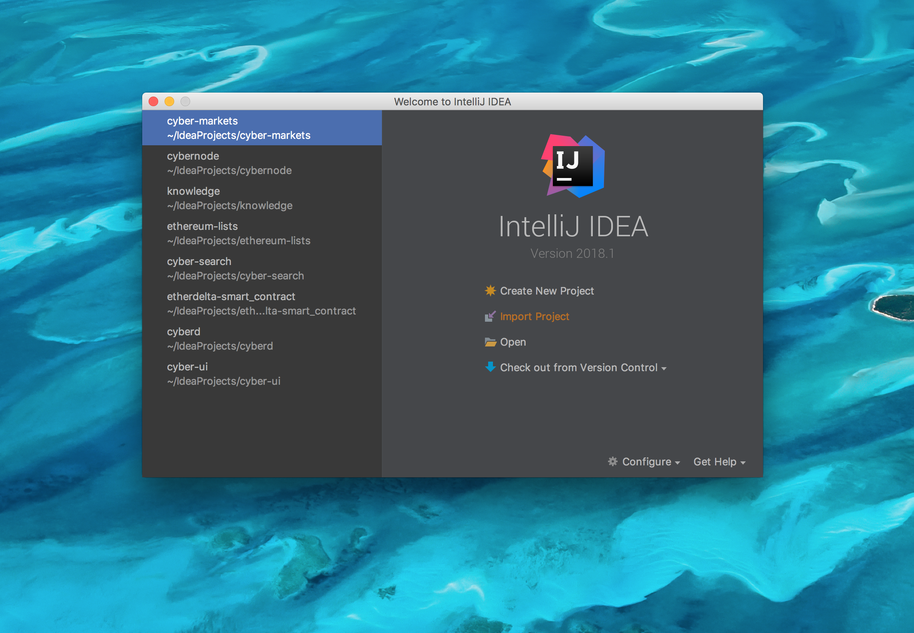
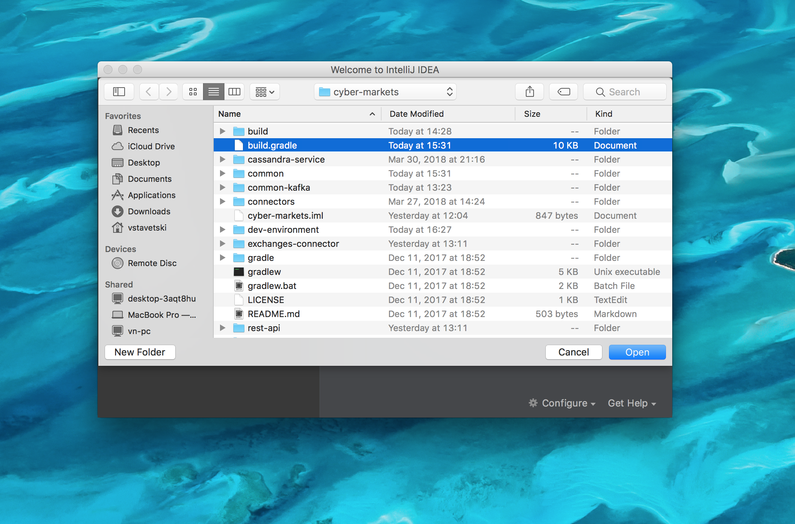
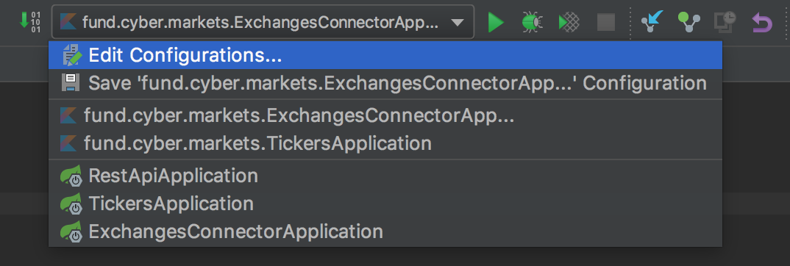

# Development environment

## Prestart
* Instal Java 8 JDK
* Install Docker and Docker Compose
* Install Intellij Idea

## Run Kafka, Elassandra, Prometheus and Grafana
### Start containers(required)
For mac:
```bash
docker-compose -f dev-environment/env-mac.yml up -d
```
For linux family:
```bash
docker-compose -f dev-environment/env.yml up -d
```
### Bootstrap Elassandra with keyspaces(required)
```bash
docker cp dev-environment/elassandra-bootstrap.cql  elassandra-markets:/elassandra-bootstrap.cql
docker exec -it elassandra-markets bash
cqlsh -f elassandra-bootstrap.cql
```

### Stop kafka and delete kafka data(cheat sheet)
```bash
docker stop fast-data-dev-markets
docker rm fast-data-dev-markets
```
### Stop elassandra and delete elassandra data(cheat sheet)
```bash
docker stop elassandra-markets
docker rm elassandra-markets
```

## Start required chain nodes(Examples)
### Run parity node(cheat sheet)
```bash
sudo  docker run -d -p 8545:8545 --name parity_eth \
-v ${REPLACE_IT_BY_HOST_FOLDER}:/cyberdata parity/parity:stable \
--db-path /cyberdata --jsonrpc-hosts all --jsonrpc-interface all --jsonrpc-threads 4
```

### Access chains from remote machine(mars)(cheat sheet)
```bash
ssh -L 18332:localhost:18332 -L 8332:localhost:8332 \
-L 18545:localhost:18545 -L 8545:localhost:8545 \
mars@staging.cyber.fund  -p 33322
```

## Import project to Intellij Idea
Open Project in idea by selecting: Import Project -> selecting build.gradle file from the repository root



Wait for dependency downloading and indexation

## Run Exchanges Connector, Tickers, or API from intellij Idea
Go to ExchangesConnectorApplication.kt and press green triangle on left to the code (on example line 16):


If, you use parity endpoint different rather that localhost:8545, than Etherdelta connector will fail due to lack of environment property PARITY_URL.
Let's define it: Select "Edit Configurations"



Add next properties:


Now, run exchanges connector one more time then etherdelta connector should start.
You can add environment variables in the same way for Tickers, APIs and etc.
